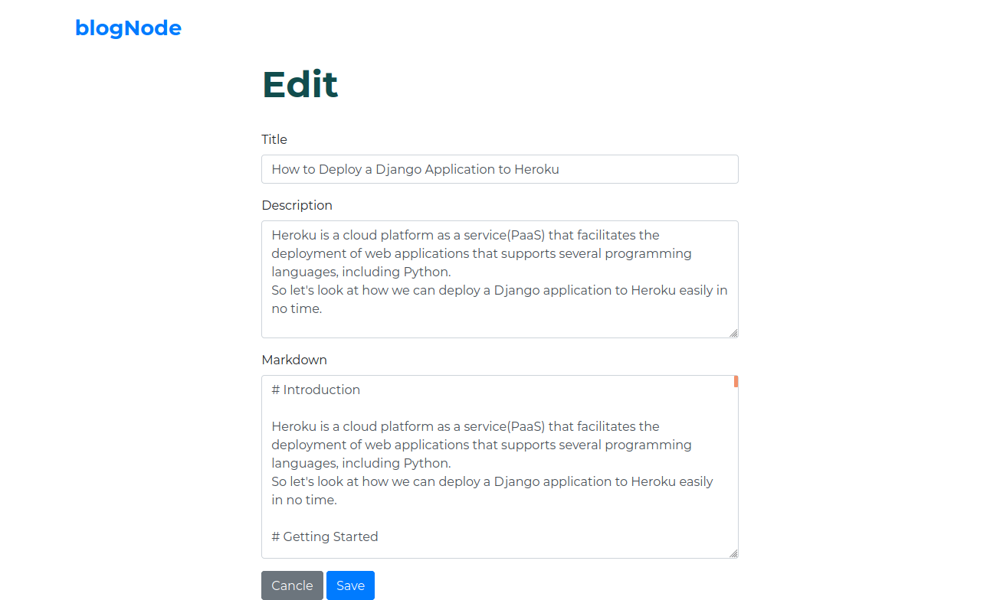

# blogNode
A markdown based blog application built with nodejs with simple CRUD operation.
### Functions:
- Create a new blog post.
- View details of a blog post.
- Update a blog post.
- Delete a blog post.

 

### Screenshots:

   
  
   <small>(Index page)</small>
   
   

   
   
  
  <small> (Details page)</small>
   
   

   
   
  
  <small> (Blog create form)</small>
   
   

   
   
  
  <small> (Blog update form)</small>
   
   

